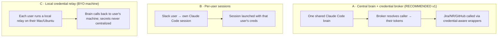
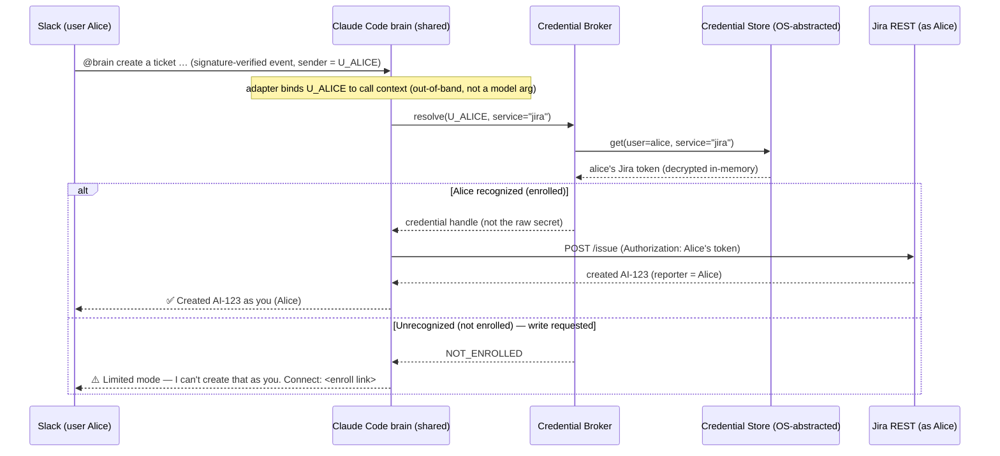

# Bring-Your-Own Credentials for the Slack Brain — Design

**Date:** 2026-06-30

**Status:** Draft — open questions pending review

**Author:** Oskar (with Claude)

**Topic:** Let Slack users talk to the central "brain" using their own credentials (Claude, Jira, New Relic, …) instead of the shared Peter-credentialed identity.

---

## 1. Context

The "brain" is a self-hosted Claude Code instance wired to Slack. Today it runs as a
single long-lived agent configured with **one** person's credentials (Peter, a PM):

- **Claude** — one Anthropic auth (API key or subscription OAuth) bills and rate-limits
  every conversation through one account.
- **Jira / Atlassian** — one MCP connection authed as Peter. Every ticket the brain
  creates or edits shows **Peter** as the actor.
- **New Relic** — one MCP connection with Peter's user key. Every NRQL query runs under
  Peter's NR account and permissions.
- **Other** (the "xx" in the request) — GitHub, Langfuse, Slack, BigQuery, Confluence.

When Alice and Bob both @-mention the brain in Slack, both act **as Peter**. That breaks
three things:

1. **Attribution / audit** — Jira and GitHub history lie. "Peter" did everything.
2. **Authorization** — everyone inherits Peter's blast radius, not their own
   least-privilege scope. Alice can touch things her own account never could.
3. **Cost & rate limits** — all Claude usage funnels through one account; one heavy user
   throttles everyone, and there is no per-person cost signal.

The goal: when a given Slack user talks to the brain, downstream actions run under **that
user's** credentials.

**Platform requirement:** the brain host runs on **macOS today**; an **Ubuntu** server
deployment is on the horizon. Anything OS-specific (notably secret storage) must work on
macOS now and have a documented Ubuntu path so we are not cornered later.

---

## 2. Goals & non-goals

**Goals**

- Per-user credentials for the **integrations** the brain calls (Jira, New Relic, GitHub,
  …), so attribution and authorization are correct per human.
- A pluggable **credential store** that works on macOS now and Ubuntu later behind one
  interface.
- A safe **enrollment** path for users to register their own credentials — no secrets
  pasted in plaintext Slack.
- A clear **fallback** when a user has not enrolled.
- Auditable: we can always answer "whose credentials executed this action?"

**Non-goals (v1)**

- Replacing Slack as the entry surface.
- A general multi-tenant SaaS. This serves one Hostaway workspace of internal users.
- Per-user fine-tuning, memory, or personalization beyond credentials.
- Solving per-user **Claude** billing if it turns out not to be required (see Q1).

---

## 3. What binds per-session vs per-call (read this first)

Two things bind **once at process startup** and cannot vary per incoming Slack user:

```text
Brain process
  ├─ ANTHROPIC_API_KEY      process-global  → one Claude billing / rate-limit identity
  └─ stock host-level MCP    atlassian, newrelic, …  authed once at startup (as Peter today)
```

But the credentials for **integrations** do not have to come from those stock MCP servers.
A **custom in-process tool** — an Agent-SDK tool / `createSdkMcpServer` handler, a custom
MCP server we write, or a credential-aware script the brain invokes — is ordinary code whose
handler runs **per call** and can select the credential for *whoever sent the current
message*. That is a first-class capability, not a workaround, and it is the foundation of
Approach A.

So the design splits cleanly along one line:

| Need | Achievable in one shared warm session? |
|---|---|
| Per-user **integration** creds (Jira/NR/GitHub attribution & scope) | **Yes** — custom credential-aware tools select the caller's token at call time. |
| Per-user **Claude** (separate billing / rate-limit / identity) | **No** — `ANTHROPIC_API_KEY` is process-global; needs a separate process env (Q1 / Approach B). |

**The crux that makes per-call selection both possible and safe:** the tool handler must know
*who sent the current message*, and that identity must be **bound out-of-band by the trusted
Slack adapter** into the execution context — never passed as a model-visible or
model-settable tool argument. If identity were an ordinary tool parameter, prompt-injected
message content could make the brain act with the wrong user's credentials (confused deputy).
§8 makes this a hard rule.

The integrations problem is the real pain (attribution + authorization). Per-user Claude
billing is a nice-to-have that costs more in architecture. The design below solves the
integrations cleanly first and treats per-user Claude as an explicit, deferrable decision (Q1).

> **❓ Q1 — Which credentials must actually be per-user (esp. Claude)?** · status: OPEN
>
> The request lists "Claude" alongside Jira/NR. But per-user Claude is the expensive part
> (forces per-user sessions), while per-user integrations are the part that fixes
> attribution and authorization.
>
> - **(a) Integrations per-user, Claude stays shared/org-billed.** *(Recommended)*
>   Solves the real pain (Jira/NR/GitHub show the right human, run at their scope) with
>   one shared brain. Claude remains an org tool billed centrally — defensible: the org
>   pays for the AI, the *human* owns the actions. Cheapest path.
> - **(b) Everything per-user, including Claude.** True per-user Claude billing &
>   rate-limits. Requires per-user sessions (Approach B in §4). Big ops jump.
> - **(c) Claude per-user, integrations shared.** Unlikely to be what anyone wants
>   (attribution stays broken); listed for completeness.
>
> Sub-fork if (b)/(c): per-user Claude via **org-issued per-user API keys** (org still
> pays, but separate keys = separate attribution + rate-limit buckets) vs **each user's
> personal Claude.ai subscription OAuth** (users burn personal Max/Pro quota for work —
> usually a non-starter). Recommend org-issued per-user keys if per-user Claude is needed.
>
> Mechanism note: because `ANTHROPIC_API_KEY` is process-global, per-user Claude does **not**
> require N permanently-warm sessions — it needs a per-user process *env*, achievable as a
> short-lived **child process spawned per turn** with that user's key, only for turns that
> need it. Lighter than Approach B's full session-per-user framing.
>
> **Recommendation:** (a) for v1. Build the credential-broker layer so adding per-user
> Claude later is an additive change, not a rewrite.

---

## 4. Approaches



**Approach A — Central brain + credential broker.** Keep one brain. A *credential broker*
maps the Slack caller to their stored tokens and executes integration calls through
credential-aware tool wrappers (not the shared MCP). Claude stays shared.
*Pros:* one process to run; minimal ops; solves attribution & authz immediately; the
credential store is the only new stateful component. *Cons:* Claude not per-user; we must
wrap each integration as a credential-aware tool instead of leaning on the stock MCP
servers; a central vault holds everyone's secrets (threat-model work, see §8).

**Approach B — Per-user sessions.** Each Slack user gets their own Claude Code
session/environment, launched with their own env (Anthropic key + MCP creds). Strongest
isolation; the only approach that makes Claude itself per-user.
*Pros:* clean isolation; stock MCP servers work unchanged (each session has one user's
creds); true per-user Claude billing/limits. *Cons:* per-user process env to provision and
garbage-collect (lightest form: a short-lived child process per turn, per Q1 — not N warm
sessions); credential injection at launch; heavier ops and cost; still needs the same secret
store underneath.

**Approach C — Local credential relay (BYO machine).** Each user runs a tiny relay on
their **own** Mac/Ubuntu holding their creds in their own OS keychain. The brain calls the
relay for that user's actions; secrets never leave the user's machine.
*Pros:* best security/privacy — no central secret store, smallest blast radius. *Cons:*
every user must run and keep alive a local process reachable from the brain (tunnel/network
config); fragile UX; offline user = broken actions. Heavy for an internal-tool audience.

**Recommendation: Approach A for v1**, with the credential-store interface and broker
designed so that (i) adding Approach B's per-user Claude sessions later is additive, and
(ii) Approach C's "secrets never centralized" stance remains a documented escape hatch if
the threat model in §8 is rejected.

> **❓ Q2 — Runtime architecture for v1?** · status: OPEN
>
> - **(A) Central brain + credential broker.** *(Recommended)* One brain, per-user
>   integration creds, central encrypted vault. Lowest ops; accepts a central secret store.
> - **(B) Per-user sessions.** Pick this only if per-user **Claude** (Q1-b) is a hard
>   requirement now. Heaviest ops.
> - **(C) Local relay.** Pick this only if a central secret store is unacceptable to
>   security (Q7). Heaviest UX.
>
> **Recommendation:** A, unless Q1 lands on (b) — then a hybrid (A's broker for
> integrations + B's sessions for Claude) is the real shape. Decide Q1 first; this follows.

---

## 5. Proposed design (Approach A)

### 5.1 Recognized vs unrecognized users (decided — see Q5)

Capability is gated on whether the **sender of the current message** is enrolled. Identity is
resolved **per inbound message** from the signature-verified Slack user id (§3, §8):

- **Recognized** (enrolled, has a credential bundle) → the brain acts with **that user's own
  credentials**: full capability, including writes — create/edit Jira tickets, open PRs,
  run NRQL under their account. Replies state it is acting *as them*.
- **Unrecognized** (no enrollment) → **limited access**: the same read-only-ish capability as
  the brain has today, via the shared identity, with **no writes as the user**. The brain
  posts a **one-time note at the start of the thread**:

  > You're not connected, so I'm in **limited mode** — I can look things up but can't create
  > or change anything as you. Connect your accounts here: `<enroll link>`.

```text
inbound Slack message
   │  sender = signature-verified slack_user_id  (recomputed every message; never cached)
   ▼
enrolled?  ──no──▶  LIMITED: shared read-only identity + one-time thread-start note
   │ yes
   ▼
FULL: act with sender's own credentials (reads + writes)
```

Because identity is resolved **per message**, a recognized user replying inside an
unrecognized user's thread still gets full capability for *their* messages, and vice-versa.
The thread-start note is a UX courtesy; the capability gate is enforced per message by the
sender's resolved identity — never by the thread, and never by anything in message content.

### 5.2 Request flow



### 5.3 Components

| Component | Responsibility | Notes |
|---|---|---|
| **Slack adapter / identity resolver** | Verified Slack `user_id` → internal user record, **per inbound message** | Trust **only** the id from Slack's signature-verified event payload (HMAC `X-Slack-Signature`) — never message text or a relayed field. Resolved fresh per event, bound out-of-band into the call context (§3), never cached across callers in the warm process. Enrollment links the Slack id to a credential bundle. |
| **Credential broker** | Given (caller, service) return a credential **handle**, or `NOT_ENROLLED` | The only component the tools talk to. Decrypts in-memory; returns a handle, never the raw secret, to the model. Never logs/traces secrets. Decrypted material is scoped to the in-flight request, not shared across concurrent callers. |
| **Credential store** | Encrypted at-rest persistence of per-user secrets | **OS-abstracted interface** — §6. The Mac/Ubuntu split lives entirely here. |
| **Credential-aware tool wrappers** | Replace stock MCP calls for Jira/NR/GitHub with calls that select the caller's credential at call time | Custom in-process tools / custom MCP / scripts over each service's REST API (§3, §5.4). |
| **Enrollment service** | Let a user register/rotate/revoke their own credentials | §7. OAuth where supported; secure CLI/web for API-key services. |
| **Audit log** | Record `(timestamp, slack_user, service, action, outcome)` — never the secret | Answers "whose creds did this?". |

### 5.4 Why credential-aware wrappers (and not stock MCP)

The stock Atlassian/NR MCP servers bind one credential at startup (§3). To attribute
per-caller within one brain we either (a) call the service REST APIs from **custom in-process
tools** (Agent-SDK tool / custom MCP / script) that select the caller's token per call, or
(b) run a per-user MCP instance. (a) is simpler and is the recommendation; (b) is heavier and
only wins if we depend on rich MCP features we don't want to reimplement.

> **❓ Q6 — Wrap REST directly, or run per-user MCP instances?** · status: OPEN
>
> - **(a) Thin credential-aware REST wrappers.** *(Recommended)* Small, explicit, easy to
>   audit; we only implement the handful of calls the brain actually makes (search/create/
>   edit issue, run NRQL, open PR/comment). Loses some MCP breadth.
> - **(b) Per-user MCP instances** launched on demand with the caller's creds. Keeps full
>   MCP surface; adds process lifecycle, warm-up latency, and resource cost per user.
>
> **Recommendation:** (a). Revisit only if we find we lean on MCP capabilities that are
> painful to reimplement.

---

## 6. Credential store — the Mac-now / Ubuntu-later core

One interface, swappable backend:

```text
CredentialStore
  get(user, service)            -> secret | NOT_FOUND
  put(user, service, secret)    -> ok
  delete(user, service)         -> ok
  list(user)                    -> [service, …]   # names only, never secrets
```

Backend matrix:

| Backend | macOS | Ubuntu (headless server) | Verdict |
|---|---|---|---|
| **OS keychain** (`security` / libsecret `secret-tool`) | ✅ native Keychain | ⚠️ GNOME Keyring needs a desktop session/DBus — awkward/broken headless | macOS-friendly; **bad** default for an Ubuntu server |
| **Encrypted file vault** (sops + age, or libsodium sealed file; master key from env/KMS) | ✅ | ✅ | **Cross-platform, server-friendly** |
| **1Password CLI (`op`)** | ✅ | ✅ | Cross-platform but adds a vendor + per-process auth |
| **HashiCorp Vault / cloud KMS** | ✅ | ✅ | Most robust; heaviest to stand up |

Honoring "start with Mac, prepare the Ubuntu path", two viable strategies:

1. **macOS Keychain now, encrypted-file vault for Ubuntu later.** Matches the phrasing
   literally; but it means two backend impls and the GNOME-Keyring trap is sidestepped only
   by switching backend on Ubuntu.
2. **Encrypted-file vault (sops+age) from day one.** Identical on Mac and Ubuntu, so the
   "Ubuntu path" is already done — the Mac/Ubuntu split collapses to "where does the master
   key live" (macOS Keychain vs env/KMS). Less code, one behavior to test.

> **❓ Q3 — Credential store backend?** · status: OPEN
>
> - **(1) macOS Keychain now → encrypted-file vault for Ubuntu.** Literal reading of the
>   request; two impls; OS-specific behavior to test.
> - **(2) Encrypted-file vault (sops+age) on both from day one.** *(Recommended)* One impl,
>   one behavior; the only OS-specific bit is where the master key is unsealed from (macOS
>   Keychain on the Mac, env var or cloud KMS on Ubuntu). Ubuntu path is essentially free.
> - **(3) 1Password CLI / Vault.** Strongest ops story if we already run one of these; extra
>   dependency otherwise.
>
> **Recommendation:** (2). It satisfies "support Mac and Ubuntu" most cheaply and avoids
> the headless GNOME-Keyring trap. Keep the `CredentialStore` interface so (3) is a drop-in
> if security later mandates a managed vault.
>
> **Ubuntu note (path-prepared regardless of choice):** do **not** plan on
> libsecret/GNOME-Keyring for the Ubuntu server — it expects a logged-in desktop session.
> On a server, unseal an encrypted file via a key from env/systemd-creds/cloud KMS. The
> **master-key bootstrap** (where that unseal key comes from on a fresh server, and who holds
> it) is the genuinely hard sub-problem and is owned by Phase 3 (§10) — a master key in a
> plain env var recreates the single-point-of-compromise §8 is trying to bound.

---

## 7. Enrollment — how users hand over their own credentials

Principle: **secrets never transit plaintext Slack** (Slack retains and indexes messages).
Per-service, pick the safest mechanism the service supports:

```text
Atlassian (Jira/Confluence)  → OAuth 3LO   : "Connect Jira" link → consent → store refresh token
GitHub                       → OAuth (or fine-grained PAT via secure form)
New Relic                    → User API key (no OAuth) : secure web form or local CLI
Langfuse / BigQuery          → key pairs / gcloud      : local CLI or secure form
```

Two delivery mechanisms for the non-OAuth (API-key) services:

- **(i) Secure web enroll page** the brain hosts: user authenticates (Slack OAuth to prove
  identity), connects OAuth services, pastes API keys over TLS into a form that writes
  straight to the credential store. One place, good UX.
- **(ii) Local enroll CLI** (`brain-enroll`) the user runs on their **own Mac/Ubuntu**: it
  can read tokens from their local keychain or prompt, then push them encrypted to the
  brain over an authenticated channel. This is the second place the **Mac/Ubuntu** support
  requirement bites — the CLI must run on both. More secure (keys can stay machine-local
  until sealed) but requires distributing a client.

Not every service fits the OAuth-or-paste-a-key shape, and v1 should treat the awkward ones
explicitly rather than fold them into "secure form": **BigQuery** uses service-account JSON /
Application Default Credentials (impersonation and project scoping differ from a bearer
token), and **Langfuse** uses public/secret key *pairs*. Each needs its own enrollment +
storage shape; scope them per-service when their phase lands (§10), not by analogy to Jira.

> **❓ Q4 — Enrollment delivery for API-key services?** · status: OPEN
>
> - **(i) Brain-hosted secure web page** (Slack-OAuth gated). *(Recommended)* One URL, best
>   UX, no client to distribute; OAuth services and API-key paste live together.
> - **(ii) Local `brain-enroll` CLI** on the user's Mac/Ubuntu. More secure, no central web
>   surface, but a client to build/ship/maintain for two OSes.
> - **(iii) Slack modal form** (interactive, not a plaintext message). Lowest friction;
>   still routes secrets through Slack's servers transiently — weakest for API keys.
>
> **Recommendation:** (i) for v1; OAuth (Atlassian/GitHub) for everything that supports it
> so the only pasted secrets are the unavoidable API-key services (New Relic). Offer (ii)
> later for security-sensitive users who refuse to paste keys anywhere central.

---

## 8. Security & threat model

Approach A centralizes **everyone's** integration tokens in one store on the brain host.
That is a high-value target and the single biggest risk in this design.

Required controls:

- **Trust the Slack identity, verifiably:** accept the sender id only from Slack's
  **signature-verified** event payload (HMAC `X-Slack-Signature` + timestamp anti-replay).
  Never derive the acting user from message text or a bot-relayed field.
- **No confused deputy:** the acting identity is **bound out-of-band** by the Slack adapter
  into the request context and is **never a model-visible or model-settable tool argument**
  (§3). Prompt-injected message content therefore cannot make the brain act as another user.
  Identity is recomputed **per inbound message** and never cached across callers in the warm
  process.
- **Fallback boundary:** a turn that used the shared identity for a low-risk read must **not**
  let a follow-up *write* ride that resolved shared identity. Writes always require the
  message sender's own resolved credentials, re-checked at the write call.
- **Secrets never reach the model or traces:** credentials are used **inside** the tool
  handler; tool results expose only a `credential_handle`/outcome, never secret material, and
  never an error string containing a token. Because the brain is wired to Langfuse / New Relic
  tracing, prompt/trace scrubbing is mandatory — a leaked token here is persisted in traces.
- **Per-request isolation under concurrency:** the warm brain serves overlapping Slack
  events; decrypted material is scoped to a single in-flight request and never shared between
  concurrent callers.
- **Encryption at rest** (the store, §6) and **in-memory-only** decryption in the broker;
  never write a decrypted secret to disk or logs.
- **Least privilege at the source:** enrollment guidance pushes users to mint **scoped**
  tokens (read-only New Relic, project-scoped Jira, fine-grained GitHub PAT). The vault's
  blast radius is bounded by what users grant, not by their full account.
- **Revocation & rotation:** `delete(user, service)` is one command; OAuth tokens prefer
  short-lived access + refresh; document a "rotate everything" runbook for host compromise.
- **Audit:** every credentialed action logs `(who, service, action, outcome)` — secret never
  logged. This is also what makes attribution provable.
- **Host hardening:** the brain host (Mac now, Ubuntu later) is now a secrets host —
  disk encryption, restricted access, no shared login.

> **❓ Q5 — Fallback when a user has NOT enrolled?** · status: RESOLVED
>
> **Resolved (2026-06-30, requested by Oskar):** recognized users act with their own
> credentials and get **full capability including writes**; unrecognized users get **limited
> access** (today's read-only-ish shared behavior, no writes as the user) plus a **one-time
> note at the start of the thread**. The capability gate is enforced **per message** by the
> sender's verified identity (§5.1), not per thread. Replies make the active identity explicit
> ("acting as you" vs "limited mode").
>
> *(Considered and rejected: (a) refuse all un-enrolled actions — too restrictive, kills the
> "useful before you enroll" property; (b) silent fallback to shared creds for writes —
> re-introduces the attribution bug.)*

---

> **❓ Q7 — Where is the line at which a central secret store becomes unacceptable?**
> · status: OPEN
>
> Not "is a vault OK in general" (for an internal tool with §8 controls, yes). The real fork
> is the **trigger**: what class of enrolled token forces us off Approach A onto Approach C
> (secrets stay on user machines) or onto a hardware-backed/managed store?
>
> - **(a) Low/medium-sensitivity tokens only** (read-mostly NR, project-scoped Jira) →
>   Approach A's encrypted central store is fine.
> - **(b) Production-write tokens present** (GitHub push to prod repos, NR/Jira admin,
>   anything that can change customer-facing state) → require either a managed/HSM-backed
>   store (Q3-3) **or** Approach C for *those* tokens specifically.
>
> **Recommendation:** Set the policy now: central store for (a); for (b), gate behind a
> managed store or keep those credentials off the central host entirely. Decide which tokens
> count as (b) with security before Phase 2 enrolls GitHub/NR writes.

---

> **❓ Q8 — Who owns token refresh / expiry?** · status: OPEN
>
> OAuth access tokens expire; API keys get rotated or revoked. When a stored credential is
> stale mid-conversation, who fixes it?
>
> - **(a) Lazy on-failure.** *(Recommended start)* Attempt the call; on 401/403 try an OAuth
>   refresh (if we hold a refresh token), else tell the user to re-enroll. Simplest; one
>   failed call per expiry.
> - **(b) Proactive refresh.** Broker refreshes OAuth tokens before expiry on a timer. No
>   user-visible failure, but a background job holding refresh tokens — more moving parts.
> - **(c) User re-enrolls every time.** No refresh-token storage at all. Most secure (we
>   store only short-lived material) but worst UX.
>
> **Recommendation:** (a) for v1; add (b) for OAuth services if expiry-time re-enrollment
> prompts become annoying. (c) only if Q7 lands on "minimize stored secrets".

---

## 9. Observability & testing

- **Unit:** `CredentialStore` contract tests run against every backend (file-vault on
  Mac/Ubuntu CI; Keychain on Mac runners). `get/put/delete/list` round-trips; "list returns
  names not secrets"; "missing → NOT_FOUND".
- **Broker:** resolves enrolled → handle; un-enrolled → `NOT_ENROLLED`; never logs secrets
  (assert log scrubbing).
- **Integration (mocked services):** a Jira create issued via Alice's credential lands with
  reporter=Alice; NRQL runs under Alice's account; expired token → graceful re-enroll prompt.
- **Security:** no secret in logs/audit/**traces or model-visible tool output**; decrypted
  material never hits disk; revocation takes effect immediately.
- **Identity / confused-deputy:** a forged or unsigned Slack event is rejected; message
  content (including injected text claiming to be another user) cannot change the acting
  identity; a recognized user's message in an unrecognized user's thread uses the recognized
  user's creds (per-message gate).
- **Concurrency:** two callers' requests in flight at once never cross credentials.
- **Manual:** two Slack users enroll, each creates a Jira ticket, confirm distinct reporters;
  an unenrolled user sees the limited-mode thread note and is refused a write.

---

## 10. Rollout / phasing

1. **Phase 0 — Credential store + broker** (no Slack change). File-vault backend, contract
   tests, on the Mac host. Master-key unseal abstraction ready for Ubuntu.
2. **Phase 1 — One integration end-to-end** (Jira via OAuth). Enrollment web page; broker
   wired into a credential-aware Jira tool; fallback per Q5.
3. **Phase 2 — New Relic + GitHub**, then the awkward-shape services (BigQuery
   service-account/ADC, Langfuse key-pairs) each with their own enrollment treatment (§7).
   Settle Q7's production-write-token policy **before** enrolling GitHub/NR writes.
4. **Phase 3 — Ubuntu host.** Same file-vault; the real work is the **master-key bootstrap**:
   where the unseal key comes from on a fresh server and who holds it (cloud KMS /
   systemd-creds / TPM-sealed / operator-entered at boot). "Master key in a plain env var"
   quietly recreates the single-point-of-compromise the §8 threat model bounds — decide this
   explicitly here, do not default to it.
5. **Phase 4 (conditional on Q1-b)** — per-user Claude via per-user process env (child
   process per turn, per Q1), not necessarily warm sessions.

---

## Open Questions

| ID | Title | Status | Recommendation |
|----|-------|--------|----------------|
| Q1 | Which credentials must be per-user (esp. Claude)? | OPEN | Integrations per-user, Claude shared for v1 |
| Q2 | Runtime architecture for v1 | OPEN | Approach A (central brain + broker) |
| Q3 | Credential store backend (Mac now / Ubuntu later) | OPEN | Encrypted-file vault (sops+age) on both |
| Q4 | Enrollment delivery for API-key services | OPEN | Brain-hosted secure web page; OAuth where supported |
| Q5 | Fallback when user not enrolled | RESOLVED | Recognized → own creds + writes; unrecognized → limited + thread note; gate per-message |
| Q6 | REST wrappers vs per-user MCP instances | OPEN | Thin credential-aware REST wrappers |
| Q7 | Where does a central secret store become unacceptable? | OPEN | Central for low-sens tokens; managed store / Approach C for production-write tokens |
| Q8 | Who owns token refresh / expiry? | OPEN | Lazy on-failure refresh for v1 |

## Resolved Decisions

- **Q5 (2026-06-30):** Recognized users act with their own credentials and get full
  capability including writes; unrecognized users get limited (read-only-ish, shared)
  access plus a one-time thread-start note. Capability is gated **per message** by the
  sender's signature-verified Slack identity, not per thread. — *Requested by Oskar during
  design; rejected "refuse all un-enrolled actions" (too restrictive) and "silent shared
  fallback for writes" (re-introduces the attribution bug).*
