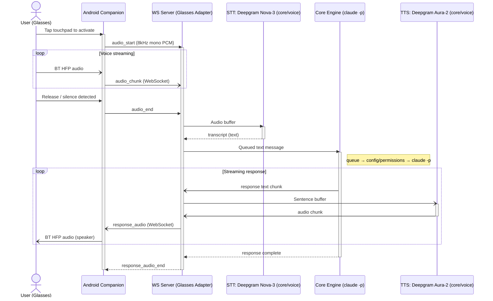

# Meta Ray-Ban Glasses Voice Channel

**Date**: 2026-03-16
**Status**: Draft
**Author**: Claude + Petro

## Overview

Add a voice-driven channel to Claudeway using Meta Ray-Ban smart glasses. Users speak to Claude through the glasses and hear responses through the glasses speaker. This requires: (1) modularizing the existing Slack-coupled codebase into a channel-agnostic core, (2) building a voice pipeline (STT/TTS), (3) a WebSocket server adapter, and (4) an Android companion app using Meta's DAT SDK.

**Voice model (MVP)**: Push-to-talk with post-stop transcription. The user taps to start, speaks, and releases/stops. Audio is buffered and transcribed after `audio_end`. This is not real-time streaming STT — it's a simpler, more reliable model for MVP. Streaming STT (transcribe while speaking) is Phase 5, after the batch path is proven end-to-end.

## E2E User Journey (MVP)

1. User puts on Ray-Ban Meta glasses; they auto-connect to the companion Android app via Bluetooth
2. User **taps the touchpad** to activate listening
3. User speaks: *"What's the status of the queue refactor in claudeway?"*
4. Glasses mic streams **8kHz mono audio** over Bluetooth HFP to companion app
5. Companion app streams audio over **WebSocket** to Claudeway server
6. Server runs **STT** (Deepgram Nova-3) to transcribe speech to text
7. Text enters the core pipeline: queue -> config/permissions -> `claude -p` -> response
8. Claude response text -> **TTS** (Deepgram Aura-2) -> audio stream
9. Audio streams back over WebSocket to companion app -> glasses speaker
10. User hears Claude's response through the glasses

## Architecture

### Design Principles

- **Voice is a core capability, not adapter-specific** -- the STT/TTS pipeline lives in `src/core/` so any future adapter (web chat, phone app) can use it
- **Adapters are thin transport layers** -- they handle connection lifecycle and message framing, then delegate to the core engine
- **Existing Slack behavior is unchanged** -- modularization is a pure refactor with no behavior changes
- **1 channel = 1 repo** -- each configured glasses channel maps to a repo/folder, same as Slack channels

### Module Structure (Post-Refactor)

```
src/
  core/
    engine.ts           # processQueuedMessage, drainChannel, concurrency pool
    interfaces.ts       # ChannelAdapter, ChannelResponder, IStreamingResponder
    voice.ts            # STT/TTS pipeline (provider-agnostic interface)
    voice-deepgram.ts   # Deepgram Nova-3 (STT) + Aura-2 (TTS) implementation
  adapters/
    slack/
      index.ts          # Slack Bolt app setup, entrypoint
      handler.ts        # registerMessageHandler, message filtering
      responder.ts      # StreamingResponder, NativeStreamingResponder, sendResponse
      formatting.ts     # markdownToSlackMrkdwn, splitMessage
      thread.ts         # fetchThreadContext, resolveUserName (Slack impl)
      commands.ts       # Magic commands (!ps, !kill, etc.)
      utils.ts          # safeReact, warnInThread
      files.ts          # downloadSlackFiles, uploadAttachedFiles
    glasses/
      index.ts          # WebSocket server setup, entrypoint
      handler.ts        # WS message routing, session management
      responder.ts      # WS-based ChannelResponder (text + audio streaming)
      protocol.ts       # WS message types/protocol definition
      test-ui/          # Simple HTML/JS page for local browser testing
  # Unchanged, already generic:
  queue.ts
  claude.ts
  config.ts
  mcp.ts
  prompt.ts             # Minor: remove Slack-specific string from formatUserDirectory
  sync-repos.ts
  tempdir.ts            # Minor: extract uploadAttachedFiles to adapter

android/                # Companion app (Kotlin/Gradle)
  app/src/main/
    kotlin/.../
      MainActivity.kt
      glasses/           # DAT SDK connection, device management
      audio/             # Bluetooth HFP mic/speaker routing
      network/           # WebSocket client to Claudeway server
      ui/                # Minimal UI (connection status, transcript)
```

### Core Interfaces

Defined in `src/core/interfaces.ts` and `src/core/voice.ts`. Key types: `ChannelResponder` (adapter response delivery), `IStreamingResponder` (streaming text/tool events), `VoiceProvider` (STT/TTS pipeline), `AudioFormat`.

### WebSocket Protocol

The glasses adapter exposes a WebSocket server. Messages are JSON-framed:

Every request/response exchange is correlated by a `requestId` (UUID, client-generated). This enables cancellation, concurrent requests, and unambiguous response routing. A `requestId` must be unique across all in-flight state within a session — the server rejects a `requestId` that is already pending (queued text) or recording (active audio).

```typescript
// Client -> Server
{ type: 'audio_start', requestId: string, format: AudioFormat }
{ type: 'audio_chunk', requestId: string, data: '<base64 PCM>' }
{ type: 'audio_end', requestId: string }
{ type: 'text', requestId: string, text: 'direct text input' }
{ type: 'cancel', requestId: string }       // Cancel an in-flight request (see cancellation semantics below)
{ type: 'ping' }

// Server -> Client
{ type: 'status', requestId: string, status: 'transcribing' | 'thinking' | 'speaking' | 'tool', toolName?: string, keyArg?: string, phase?: string, description?: string }
{ type: 'transcript', requestId: string, text: 'what user said', final: boolean }
{ type: 'response_text', requestId: string, text: 'claude response chunk', final: boolean }
{ type: 'response_audio', requestId: string, data: '<base64 PCM>' }
{ type: 'response_audio_end', requestId: string }
{ type: 'error', requestId: string | null, message: '...' }  // null requestId = connection-level error
{ type: 'pong' }
```

**Cancellation semantics**: A `cancel` message applies to a specific `requestId`. The server's behavior depends on the current state of that request:

- **Queued** (not yet processing): removed from queue, server sends `error` with message `"cancelled"`.
- **Transcribing** (STT in progress): STT request is aborted, partial transcript discarded, server sends `error` with `"cancelled"`.
- **Thinking** (Claude processing): Claude CLI process is killed (`SIGTERM`), server sends `error` with `"cancelled"`.
- **Speaking** (TTS streaming): TTS generation is aborted, no further `response_audio` chunks sent, server sends `response_audio_end` followed by `error` with `"cancelled"`.
- **Unknown requestId** or already completed: server ignores the `cancel` silently (no error).

### Config Extension

```yaml
# config.yaml additions
glassesServer:
  enabled: true
  port: 8765
  # Auth model: each token maps to a userId + default channel.
  # The userId is resolved against channel allowedUsers for permissions,
  # exactly like Slack userId resolution.
  auth:
    tokens:
      - token: '${GLASSES_AUTH_TOKEN}'
        userId: glasses-petro           # Used for permission resolution
        defaultChannel: glasses-default  # Channel to use when client doesn't specify

voice:
  provider: deepgram
  deepgram:
    apiKey: '${DEEPGRAM_API_KEY}'
    sttModel: nova-3
    ttsModel: aura-2-thalia-en
    ttsVoice: thalia
    ttsSampleRate: 24000       # 24kHz for browser testing; 8000 for glasses hardware

# Glasses channels work the same as Slack channels
channels:
  glasses-default:            # Not a Slack channel ID, just an identifier
    name: my-glasses
    repo: claudeway
    allowedUsers:
      - 'glasses-petro'    # Must match the userId from glassesServer.auth.tokens
    model: opus
```

### Voice Pipeline Detail



**Audio resampling**: The glasses mic outputs 8kHz mono (Bluetooth HFP limitation). Deepgram Nova-3 accepts 8kHz natively (no upsample needed -- it handles it). TTS output sample rate is config-driven (`voice.deepgram.ttsSampleRate`, default 24000). Phase 3 uses 24kHz for browser test UI quality; Phase 4 switches to 8kHz to match the glasses Bluetooth HFP speaker path.

## Implementation Phases

### Phase 0: Modularize Core [COMPLETE]

Extracted `src/core/engine.ts` and `src/core/interfaces.ts` from Slack-coupled code. All Slack-specific code moved to `src/adapters/slack/`. Zero Slack imports in `src/core/`.

### Phase 1: WebSocket Server + Text Pipeline [COMPLETE]

Built `src/adapters/glasses/` — protocol, handler (session management, queue key namespacing), responder, WS server with token auth. Added browser test UI.

### Phase 2: STT Integration (Audio In) [COMPLETE]

Push-to-talk audio: chunks buffered until `audio_end`, then batch STT via Deepgram Nova-3 prerecorded API. Voice provider interface in `src/core/voice.ts`, Deepgram implementation in `src/core/voice-deepgram.ts`. Audio session management with size limits. Dual format support (WebM/Opus from browser, raw PCM from device).

### Phase 3: TTS + Full Voice Loop + Cancellation [COMPLETE]

Full voice round-trip: audio in → STT → Claude → TTS → audio out.

**TTS**: Deepgram Aura-2 over native WebSocket (not the SDK — SDK's `JSON.parse()` drops binary audio frames). Prose chunker (`src/core/prose-chunker.ts`) splits streaming text at sentence boundaries for incremental TTS. Flush coalescing to stay within Deepgram's 20/60s rate limit.

**Cancellation** across all states: transcribing (AbortSignal), thinking (process kill via `onProcessSpawned` callback), speaking (TTS stream clear/abort). Tracked per-requestId in session.

**Config additions**: Per-channel `effort` level (low/medium/high/max) passed as `--effort` to Claude CLI. Per-channel `model` override. Voice-optimized `systemPrompt` for glasses (plain spoken language, no markdown). Note: Deepgram `speed` param is REST-only, not available on WebSocket TTS.

**Test UI**: Full mic + speaker with Web Audio API playback, push-to-talk, visual status indicators.

### Phase 4: Android Companion App

**Goal**: End-to-end with actual Meta Ray-Ban glasses.

**Structure**:
```
android/
  app/
    build.gradle.kts
    src/main/
      AndroidManifest.xml
      kotlin/com/claudeway/glasses/
        ClaudewayApp.kt          # Application class, DAT SDK init
        MainActivity.kt           # Single-activity app
        glasses/
          GlassesViewModel.kt     # DAT SDK device connection state
          GlassesManager.kt       # Device discovery, registration, permissions
        audio/
          AudioRouter.kt          # Bluetooth HFP routing (mic + speaker)
          AudioRecorder.kt        # PCM capture from glasses mic
          AudioPlayer.kt          # PCM playback to glasses speaker
        network/
          ClaudewayWebSocket.kt   # WS client (OkHttp or Ktor)
          Protocol.kt             # Message types matching server protocol
        ui/
          ConnectionScreen.kt     # Jetpack Compose: server URL, connection status
          ConversationScreen.kt   # Transcript display, manual text input fallback
      res/
        ...
  build.gradle.kts
  settings.gradle.kts
  gradle/
    libs.versions.toml            # DAT SDK, OkHttp, Compose versions
```

**Key implementation details**:

1. **DAT SDK setup**: `Wearables.initialize()` in `Application.onCreate()`, registration flow via Meta AI companion app
2. **Audio routing**: Standard Android `AudioManager.setCommunicationDevice()` to route to Bluetooth SCO device. Must configure HFP **before** any DAT camera sessions.
3. **Audio capture**: `AudioRecord` with Bluetooth SCO source, 8kHz mono PCM Int16
4. **Audio playback**: `AudioTrack` routed to Bluetooth SCO device, matching format from TTS
5. **WebSocket**: OkHttp's WS client, auto-reconnect, auth via bearer token
6. **Activation**: Touchpad tap detected via DAT SDK gesture events, or a simple "hold to talk" UI button as fallback

**DAT SDK requirements**:
- Android 10+ (API 29+)
- Meta AI companion app installed on phone
- Developer Mode enabled in Meta AI app settings
- GitHub token for pulling SDK from GitHub Packages
- Supported: Ray-Ban Meta Gen 1 & Gen 2

**Tests (Android, JUnit + MockK)**:
- `ClaudewayWebSocketTest` -- WebSocket client:
  - Connects with auth token, receives `pong` on `ping`
  - Reconnects automatically on connection drop
  - Serializes/deserializes protocol messages correctly
- `AudioRouterTest` -- Bluetooth HFP routing:
  - Finds SCO device from `AudioManager.availableCommunicationDevices`
  - Sets communication device correctly
  - Handles missing SCO device (no glasses connected) gracefully
- `AudioRecorderTest` -- PCM capture:
  - Produces 8kHz mono Int16 PCM buffers
  - Stops cleanly on release
- `ProtocolTest` -- shared protocol types:
  - Kotlin message types match TypeScript protocol definition (snapshot test against JSON fixtures)
- **Integration** (requires DAT MockDeviceKit, no physical glasses):
  - `GlassesManagerTest` -- device discovery and registration flow using `MockDeviceKit`
  - Full pipeline mock: simulated touchpad event → audio capture → WS send → mock server response → audio playback
- **Manual E2E**: put on glasses, tap touchpad, speak, hear response

### Phase 5: Streaming STT

**Goal**: Replace batch transcription with real-time streaming STT for lower perceived latency. Partial transcripts appear while the user is still speaking.

**Prerequisite**: Phases 0–4 complete and stable. Batch voice path working end-to-end with glasses hardware.

**Changes**:

1. Add `transcribeStream()` implementation in `src/core/voice-deepgram.ts` using Deepgram's real-time WebSocket API
2. Update glasses handler: on `audio_start`, open a streaming STT session; forward `audio_chunk` directly to Deepgram WS instead of buffering
3. Emit `transcript` messages with `final: false` as partial results arrive, `final: true` on utterance end
4. On `audio_end`, close the Deepgram STT stream and wait for the final transcript before passing to Claude
5. Update `cancel` handling: cancellation during streaming transcription closes the Deepgram WS session
6. Add config flag `voice.sttMode: 'batch' | 'streaming'` (default: `batch`) — batch remains the fallback until streaming is proven stable

**Tests**:
- `src/__tests__/voice-deepgram-streaming.test.ts` -- streaming STT (mocked Deepgram WS):
  - Opens Deepgram WS with correct model/format params
  - Forwards audio chunks as they arrive
  - Emits partial transcripts from Deepgram interim results
  - Emits final transcript on utterance_end
  - Handles Deepgram WS disconnect/reconnect gracefully
- `src/__tests__/glasses-handler-streaming-stt.test.ts` -- integration with glasses handler:
  - Partial `transcript` messages sent to client during recording
  - Final transcript triggers Claude processing (same as batch path)
  - `cancel` during streaming STT closes Deepgram session cleanly
  - Fallback: if `sttMode: 'batch'`, handler uses existing buffer-then-transcribe path
- Latency benchmark: first partial transcript appears within 500ms of first `audio_chunk`
- No regression: batch path tests still pass, text-only path unaffected

**Exit criteria**:
- First partial transcript within defined latency target (~500ms)
- Final transcript quality matches or improves on batch path
- Cancel works during recording, transcribing, and speaking
- No regression to text-only or batch voice path
- Batch remains default in config until streaming passes soak testing

**Design constraint**: Streaming STT adds a persistent WebSocket connection to Deepgram per active recording session. This is fine for single-user MVP but would need connection pooling for multi-user. The `VoiceProvider` interface already has the `transcribeStream()` method stubbed — this phase implements it.

### Phase 6: Voice Activity Detection (Hands-Free Mode)

**Status**: Post-MVP / experimental. Not part of the initial delivery target (Phases 0–5).

**Goal**: Replace push-to-talk with automatic speech detection — the user just speaks and the system figures out when they started and stopped.

**Prerequisite**: Phase 5 (Streaming STT) complete and stable. Streaming STT provides the real-time audio stream and Deepgram's `utterance_end` events that VAD builds on.

**Approach**: Client-side energy-based VAD on the companion app. The app runs a lightweight amplitude-threshold detector locally. On speech detection, sends `audio_start` and begins streaming to the server. On local silence timeout, sends `audio_end`. Server-side uses streaming STT (Phase 5) with Deepgram's `utterance_end` for precise end-of-speech detection, overriding the client's coarse silence timeout when they disagree.

This preserves the existing `audio_start`/`audio_end` protocol framing — the server doesn't need to know whether the client used push-to-talk or auto-detection. The only change is who triggers start/stop: user's finger vs. the VAD.

**Why not always-on server streaming**: Keeping a Deepgram STT WebSocket open continuously per session has unbounded API cost and battery drain on the phone (continuous audio capture + network). Client-side energy detection is near-zero cost during silence and only opens the server path when speech is likely. If Phase 5 soak testing reveals that Deepgram's per-connection cost is negligible, always-on could be revisited as a simplification.

**Changes**:

1. Add `voice.vadMode: 'push-to-talk' | 'auto'` config flag (default: `push-to-talk`)
2. Android companion app: add `EnergyVadDetector` — monitors mic amplitude, fires start/stop callbacks
3. When `vadMode: 'auto'`, companion app uses VAD to auto-send `audio_start`/`audio_end` instead of requiring touchpad tap
4. Add `status: 'listening'` server message to indicate system is ready for speech (sent after response completes)
5. Server-side: no audio framing or request-path changes needed (same `audio_start`/`audio_end` flow)

**Tests**:
- `EnergyVadDetectorTest` (Android): silence produces no start event, speech above threshold triggers start, silence after speech triggers stop
- Server: no new tests needed (existing audio flow tests cover it)
- Manual: speak without tapping, verify transcription and response
- Fallback: `vadMode: 'push-to-talk'` uses existing touchpad flow unchanged

### Phase 7: Barge-In (Response Interruption)

**Status**: Post-MVP / experimental. Depends on Phase 6 (VAD) or can be used with push-to-talk.

**Goal**: Allow the user to interrupt Claude mid-response by speaking. The current response is cancelled and the new utterance is processed.

**Prerequisite**: Phase 3 cancellation plumbing (thinking/speaking abort) is the mechanical foundation. Phase 6 (VAD) makes barge-in natural (user just starts talking) but barge-in also works with push-to-talk (user taps while response is playing).

**Policy decisions** (must be resolved before implementation):

1. **Conversation context**: When a response is interrupted, does the partial response enter conversation history? Options: (a) discard partial response entirely, (b) keep partial response with a `[interrupted]` marker, (c) keep full partial text but truncate at interruption point. This affects Claude's context for the next turn.
2. **Queue behavior**: If a request is queued while another is speaking, does the new request cancel the old one automatically, or does it queue behind? For single-user glasses, auto-cancel is likely correct (the user changed their mind).
3. **Debounce**: Short accidental sounds (cough, background noise) shouldn't cancel a response. Minimum speech duration threshold before triggering barge-in (e.g., 500ms of detected speech).

**Changes**:

1. `audio_start` (or VAD-triggered start) during speaking state → auto-send `cancel` for the active requestId
2. Handler: detect `audio_start` while `activeResponders` has an entry → cancel active, then proceed with new recording
3. Responder: on cancel during speaking, truncate conversation history per chosen policy
4. Add `voice.bargeIn: boolean` config flag (default: `false`)

**Tests**:
- Barge-in during speaking: TTS aborts, new audio is recorded and processed
- Barge-in during thinking: Claude process killed, new audio processed
- Short noise during speaking: below debounce threshold, response continues
- `bargeIn: false`: `audio_start` during speaking is rejected with error (current behavior)

## Key Technical Decisions

### Why Deepgram (Single Provider for STT + TTS)?

| Criteria | Deepgram | Groq | OpenAI |
|----------|----------|------|--------|
| STT streaming | Yes (real-time WS) | No (batch only) | No |
| TTS streaming | Yes | No | Yes |
| STT quality | Nova-3 (excellent) | Whisper v3 (excellent) | Whisper (good) |
| TTS quality | Aura-2 (good) | Orpheus (good, 200 char limit) | TTS-1-HD (very good) |
| Latency | Very low | Very low (STT), unknown (TTS) | Moderate |
| Single provider | Yes (both) | No (TTS too limited) | Yes (both, but no streaming STT) |

Deepgram wins on streaming support for both directions. The `VoiceProvider` interface makes it swappable.

### Why Kotlin Native (Not Cross-Platform)?

The DAT SDK is a native Android library using Kotlin coroutines and `StateFlow`. Cross-platform frameworks (React Native, Flutter) would require building a native bridge module that wraps every SDK call -- adding complexity without benefit since:
- The companion app is thin (transport + audio routing only)
- iPad support would use a separate Swift thin client connecting to the same WebSocket server
- The DAT SDK has no iOS equivalent API surface (iOS uses Swift's MWDATCore framework)

### Why WebSocket (Not HTTP)?

Real-time bidirectional audio streaming requires persistent connections. HTTP would add per-request overhead and can't push audio chunks server->client without polling. WebSocket provides:
- Low-latency bidirectional framing
- Natural fit for audio chunk streaming
- Connection state management (know when client disconnects)
- Compatible with Bun's native WebSocket support

### Monorepo Layout

Server (TypeScript/Bun) and Android app (Kotlin/Gradle) in one repo:
- Shared `config.yaml` (server reads it, Android app just needs WS URL from it)
- Atomic cross-stack changes (protocol changes update both sides in one commit)
- Single CI pipeline
- `docker-compose.yml` only builds/runs the server; Android builds separately via Gradle

## Security Considerations

- **Auth**: Bearer token in WS handshake (`Sec-WebSocket-Protocol` header or query param). Token maps to a `userId` + `defaultChannel` via `glassesServer.auth.tokens` config. Auth flow: bearer token -> lookup in config -> resolve `userId` -> use `userId` with `resolveUserPermissions()` against channel's `allowedUsers`. Single-user tool, so a shared secret suffices for MVP.
- **Network**: WS server binds to `localhost` by default. For remote access (glasses on different network), use a reverse proxy with TLS or a tunnel (e.g., Tailscale).
- **Permissions**: Glasses channels use the same `resolveUserPermissions` as Slack. The `userId` from the token mapping resolves against the channel's `allowedUsers` list, exactly like Slack user IDs.
- **Voice data**: Audio is processed in-memory, streamed to Deepgram, not persisted to disk. Transcripts flow through the normal queue (file-based, same as Slack messages).

## Out of Scope (Future)

- Camera/photo input (Phase 8+)
- iPad/iOS companion app
- Multi-user glasses support
- Custom wake word (replacing "Hey Meta")
- Conversation history display on glasses HUD (Ray-Ban Display only)
- Offline/edge STT
